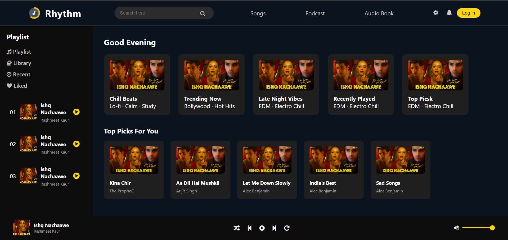

# 🎵 Rhythm - Music Web App UI

**Rhythm** is a modern and aesthetically pleasing music web app user interface inspired by Spotify.  
This is a **static frontend design** built using **HTML and CSS only** — no JavaScript functionality or APIs have been implemented yet.

---

## 📸 Preview

---

## ✨ Features (UI Only)

- 🎧 Dark-mode layout
- 🎨 Clean sidebar navigation (Playlist, Library, Recent, Liked)
- 🔍 Search bar
- 📁 Categorized sections like:
  - "Good Evening"
  - "Top Picks For You"
- 🎵 Playlist song cards with song name, artist & play icon
- 🎚️ Audio player UI (bottom bar with controls and volume slider)
- 🟡 Yellow accent color inspired by the logo

---

## 🔧 Tech Stack

- **HTML5**
- **CSS3**
- **Font Awesome** (icons)
- **Responsive layout** (basic)

---

## 📂 Folder Structure
1. Images
2. index.html
3. style.css

